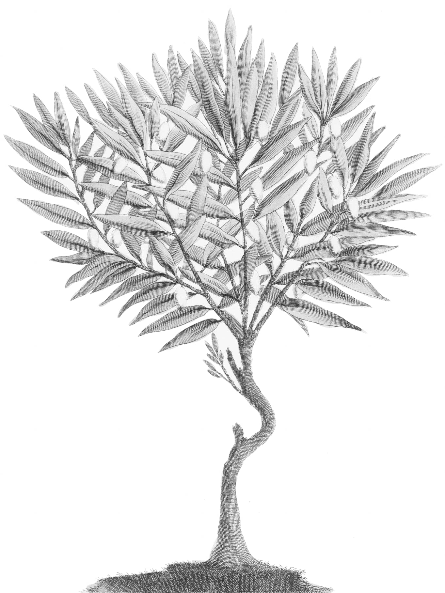

---
#
# By default, content added below the "---" mark will appear in the home page
# between the top bar and the list of recent posts.
# To change the home page layout, edit the _layouts/home.html file.
# See: https://jekyllrb.com/docs/themes/#overriding-theme-defaults
#
layout: page-no-menu
---



# Academics Lost

## Dr. Refaat Alareer
### Historian, Writer, Poet.

On December 6, the poet, writer, literature professor, and activist Dr. Refaat Alareer was killed in a targeted Israeli airstrike that also killed his brother, his sister, and four of her children. He is survived by his wife, Nusayba, and their children. Alareer was a professor of literature and creative writing at the Islamic University of Gaza, where he taught since 2007. He was the co-editor of Gaza Unsilenced (2015) and the editor of *Gaza Writes Back: Short Stories from Young Writers in Gaza*, Palestine (2014). Alareer was also one of the founders of *We Are Not Numbers*, a nonprofit organization launched in Gaza after Israel’s 2014 attack and dedicated to creating “a new generation of Palestinian writers and thinkers who can bring together a profound change to the Palestinian cause.” ,In the wake of his death, Alareer’s heartbreakingly prophetic farewell poem, “If I Must Die,” has been translated into more than 40 languages; it has been read aloud from stages and written on the subway walls; it has been printed onto banners and placards and flags and kites held aloft in ceasefire demonstrations around the world.

## Dr. Heba Abu Nada
### Novelist, poet, and educator.

Novelist, poet, and educator Heba Abu Nada, a beloved figure in the Palestinian literary community and the author of the novel *Oxygen is Not for the Dead*, was killed by an Israeli airstrike in southern Gaza on October 20. In her final Facebook post, published on October 8, the author wrote:

*Gaza’s night is dark apart from the glow of rockets, quiet apart from the sound of the bombs, terrifying apart from the comfort of prayer, black apart from the light of the martyrs. Good night, Gaza.*

Abu Nada was educated at Islamic University, Gaza, where she was awarded a bachelor’s degree of biochemistry. She went on to receive a master’s degree in clinical nutrition from Al-Azhar University, Gaza. In 2017, Abu Nada won the Sharjah Award for Arab Creativity for Oxygen is Not for the Dead. You can read two of her final poems, translated from the original Arabic by Huda Fakhreddine, here and here.

## Belal Jadallah
### Journalist

max-width: 80%
max-height: 80%
}

Belal Jadallah, one of the most beloved and respected journalists in Gaza, was killed on November 21 in the Zeitoun area of Gaza City.
Known locally as “the godfather of Palestinian journalists,” Jadallah was the founder and chairman of the Gaza Press House—an organization dedicated to training the region’s future journalists and enhancing freedom of expression. He worked closely with many, if not most, of the local journalists in Gaza, helping dozens of aspiring reporters to get started in their careers through his mentorship programs.

## Doaa Al-Masri
### Librarian

Doaa was the librarian at the Edward Said Public Library in Gaza. She was a kind and energetic young woman who organized many activities for children and youth at the library including reading groups, classes, and field trips for schools. Doaa was also a volunteer in many other projects. During each Israeli attack on Gaza, she joined her colleagues at MECA partner Youth Vision Society in procuring, packing, and delivering emergency aid to children and families. Just last week, in the midst of intense Israeli attacks, she joined two other volunteers to provide warm clothes to children in northern Gaza.

## Abdul Karim Hashash
### Writer, researcher, and educator

The writer and Palestinian heritage advocate Abdul Karim Al-Hashash (76 years old), along with many of his family members, was killed on October 23 in the city of Rafah. Al-Hashash was known for his teaching, as well as his writings on Palestinian folk heritage and his research on Bedouin heritage, customs, and Arab proverbs. He also collected dozens of rare books about Palestine, its history, and its heritage in his library.
