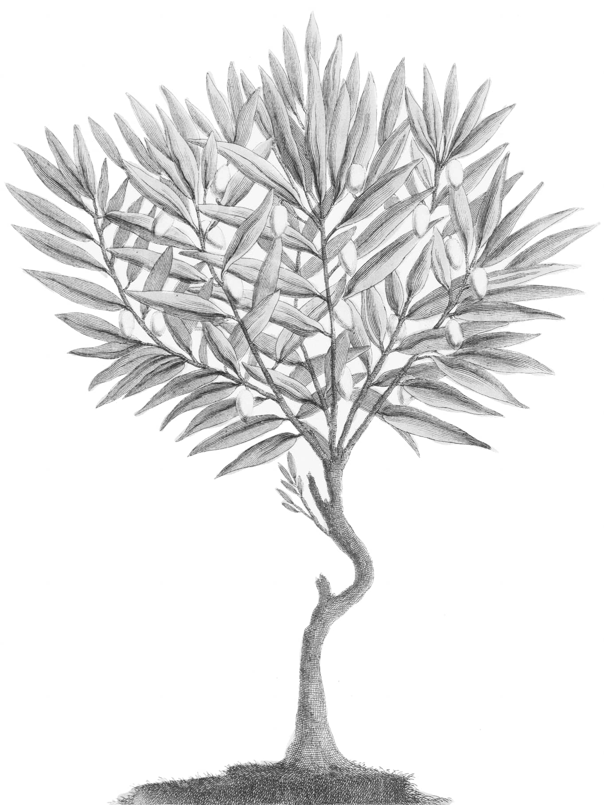
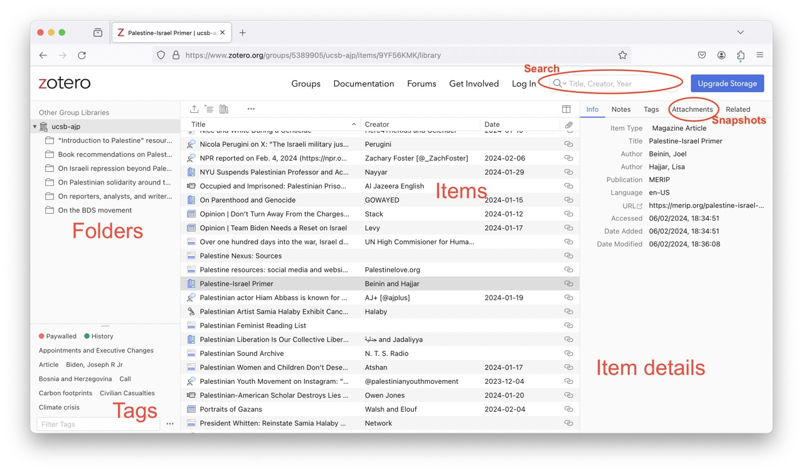

---
#
# By default, content added below the "---" mark will appear in the home page
# between the top bar and the list of recent posts.
# To change the home page layout, edit the _layouts/home.html file.
# See: https://jekyllrb.com/docs/themes/#overriding-theme-defaults
#
layout: page-no-menu
---

## What is Olive Tree SB?
**Olive Tree SB** is a collection of resources for learning about Palestine, put together by Academics for Justice in Palestine in Santa Barbara, California. 

## How do I use it?

We have curated a few **[introductory resources](#introductory-resources-palestine-101)** below that are a great place to start. If you would like to go further, we also maintain an ever expanding shared **[database](#full-database)** of articles, news stories, social media posts, and links to projects of different kinds, which you can access here too.

## How can I contribute?
Please join us in archiving the events, teach-ins, and SJP activities we support by [**filling out this form**](https://docs.google.com/forms/d/e/1FAIpQLScVn7mlhGwQKr48etRbG_0kOLf3RK_-kUMjbYWUa_l8abkaFQ/viewform) to help us document ourselves throughout these urgent and unprecedented times.



# Introductory Resources: Palestine 101

### Historical Primer (19th-century – 2013)
- [Beinin, Joel and Lisa Hajjar, “Palestine, Israel and the Arab-Israeli Conflict: A Primer.” (Washington, DC: Middle East Research and Information Project, 2014).](https://merip.org/palestine-israel-primer/)

### Gaza in Context
A collaborative series of teach-ins on YouTube hosted by [Jadaliyya](https://www.jadaliyya.com).
1. [Gaza 101](https://www.youtube.com/watch?v=aAKWgcpeYNo)
2. [Gaza in History](https://www.youtube.com/watch?v=tnyYDLMz95g&list=PLLkT5TSHWFSbqXKnNSa3nPJh4yYdk9KGA&index=2)
3. [Gaza in Geography](https://www.youtube.com/watch?v=Lpxri63NAcU&list=PLLkT5TSHWFSbqXKnNSa3nPJh4yYdk9KGA&index=21&pp=iAQB)
4. [Human Rights, Gaza, and the War on Palestine](https://www.jadaliyya.com/Details/45455/Gaza-in-Context-A-Collaborative-Teach-In-Series-%E2%80%94-Human-Rights,-Gaza,-and-the-War-on-Palestine)
5. [Antisemitism & Anti-Zionism](https://www.jadaliyya.com/Details/45480/Gaza-in-Context-A-Collaborative-Teach-In-Series-%E2%80%94-Antisemitism--Anti-Zionism)
6. The Social History of Gaza (upcoming, 11/14)

### Useful Social Media Accounts to Follow
1. [tbd]
2. [tbd]
3. [tbd]

### Reports from Other Organizations
1. B’Tselem: The Israeli Information Center for Human Rights in the Occupied Territories
2. Jewish Voice for Peace 
3. Boycott, Divest, Sanction Movement

### AJP Winter Break Reading List
[Click here](https://ajp-database.notion.site/UCSB-AJP-Winter-Break-Reading-List-f1ce080e9b914f10a020b31b2c7d9e78) to see AJP's recommended selection of short articles and online media for Winter Break 2023-2024.



# Full database
[**Click here to open our database**](https://www.zotero.org/groups/5389905/ucsb-ajp/library). 

### What is it?
The database is a collection of articles, news stories, social media posts, and links to projects of different kinds. 

It runs on the open-source bibliographic software [Zotero](https://www.zotero.org). If you are new to it, you might want to look at the instructions and documentation below.

### What's in it?
The database is organised into six main folders:
1. Websites with "introduction to Palestine" resources.
2. Book recommendations on Palestine. 
3. Web resources on Israel’s involvement in repression outside of Palestine.
4. Web resources on Palestinian solidarity movements around the world.
5. Web resources to the BDS movement and the people doing this work.
6. Web resources on reporters, analysts, journalists, writers on Palestine working on the ground and beyond.

You can browse it through these categories, dozens of thematic tags, or simply search through it.

### How to use it on your phone
Click through the slides below to see how to use the database on your phone, and to get an idea of the different elements of the Zotero interface.



### How to use it on your desktop
The database is easier to use on your desktop because all the elements described above are visible on one screen.

For more information on Zotero and how to use it, you might want to review its [Quick Start Guide](https://www.zotero.org/support/quick_start_guide).